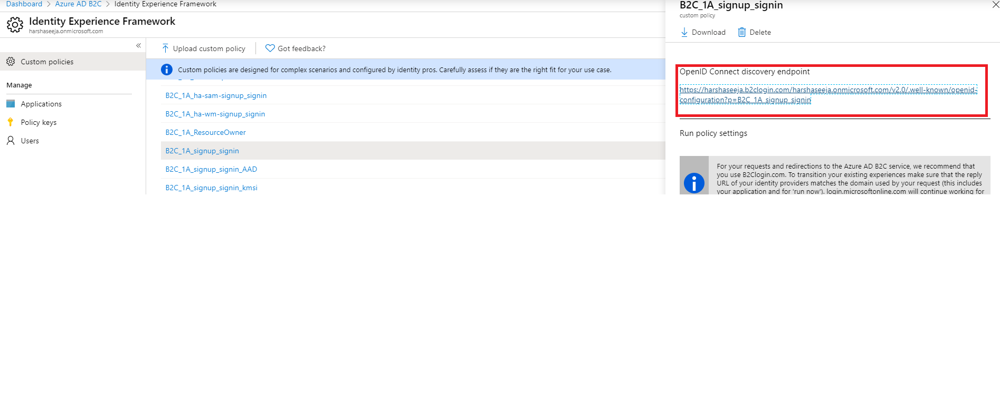

# SignUp with email invitation
This sample console app (.Net core) demonstrates how to send sign-up email invitation. The web application sends an email to the end user with a link to sign-up policy. The link to the sign-up policy contains the email address, which is encapsulated inside a JWT token (id_token_hint). When a user clicks on that link, Azure AD B2C validates the JWT token signature, reads the information from the token, extracts the email address and ask the user to set the password, display name, surname and given name.

## User flow
To invite a user, from the application, type the user's **email address** and click **Send invintation**. The application sends a sign-in link (with a id_token_hint). User clicks on the link, that takes to user to Azure AD B2C policy. Azure AD B2C validate the input id_token_hint, asks the user to provide the password and user data (the email is read only). User clicks continue, Azure AD B2C creates the account, issues an access token, and redirect the user back to the application.  


## Sending Application Data
The key of sending data to Azure AD B2C custom policy is to package the data into a JWT token as claims (id_token_hint). In this case, we send the user's email address to Azure B2C. Sending JWT token requires to host the necessary metadata endpoints required to use the "id_token_hint" parameter in Azure AD B2C.

ID tokens are JSON Web Tokens (JWTs) and, in this application, are signed using RSA certificates. This application hosts an Open ID Connect metatdata endpoint and JSON Web Keys (JWKs) endpoint which are used by Azure AD B2C to validate the signature of the ID token.

The web app has following endpoints:
* **/.well-known/openid-configuration**, set this URL in the **IdTokenHint_ExtractClaims** technical profile
* **/.well-known/keys**

## Community Help and Support
Use [Stack Overflow](https://stackoverflow.com/questions/tagged/azure-ad-b2c) to get support from the community. Ask your questions on Stack Overflow first and browse existing issues to see if someone has asked your question before. Make sure that your questions or comments are tagged with [azure-ad-b2c].
If you find a bug in the sample, please raise the issue on [GitHub Issues](https://github.com/azure-ad-b2c/samples/issues).
To provide product feedback, visit the Azure Active Directory B2C [Feedback page](https://feedback.azure.com/forums/169401-azure-active-directory?category_id=160596).

### Creating a signing certificate
The sample application uses a self-signed certificate to sign the ID tokens. You can generate a valid self-signed certificate for this purpose and get the thumbprint using PowerShell *(note: Run as Administrator)*:
```Powershell
$cert = New-SelfSignedCertificate -Type Custom -Subject "CN=MySelfSignedCertificate" -TextExtension @("2.5.29.37={text}1.3.6.1.5.5.7.3.3") -KeyUsage DigitalSignature -KeyAlgorithm RSA -KeyLength 2048 -NotAfter (Get-Date).AddYears(2) -CertStoreLocation "Cert:\CurrentUser\My"
$cert.Thumbprint
```
#### If you have issues with the cert you created you can also try creating a cert using another way. See steps here: https://github.com/azure-ad-b2c/saml-sp#11-preparing-self-signed-certificate

### Configuring the application
Update the *appSettings* values in **appsettings.json** with the information for your Azure AD B2C tenant and the signing certificate you just created.
* **B2CTenant**: Your Azure AD B2C tenant name (without *.onmicrosoft.com*)
* **B2CPolicy**: The policy which you'd like to send the id_token_hint
* **B2CClientId**: The application ID for the Azure AD B2C app you'd like to redirect to
* **B2CRedirectUri**: The target redirect URI for your application
* **B2CSignUpUrl** the link to B2C format
* **SigningCertThumbprint**: The thumbprint for the signing certificate you just created
* **SigningCertAlgorithm**: The certificate algorithm (must be an RSA algorithm)
* **LinkExpiresAfterMinutes**: Link expiration (in minutes) 
* **SMTPServer**: Your SMTP server
* **SMTPPort**: Your SMTP server port number
* **SMTPUsername**: SMTP user name, if necessary
* **SMTPPassword**: SMTP password, if necessary
* **SMTPUseSSL**: SMTP use SSL, true of false
* **SMTPFromAddress**: Send from email address
* **SMTPSubject**: The invitation email's subject


### Running the application
When you run the application, you'll be able to enter the email of a user. When you click on **Send invite**, the app sends a sign-in email to the account you specified.

To inspect the generated token, copy and paste it into a tool like [JWT.ms](htttps://jwt.ms).

### Hosting the application in Azure App Service
If you publish the application to Azure App Service, you'll need to configure a valid certificate with a private key in Azure App Service.
1. First, export your certificate as a PFX file using the User Certificates management tool (or create a new one)
2. Upload your certificate in the **Private Certificates** tab of the **SSL Settings** blade of your Azure App Service
3. Follow [these instructions](https://docs.microsoft.com/en-us/azure/app-service/app-service-web-ssl-cert-load#load-your-certificates) to ensure App Service loads the certificate when the app runs

### Using B2C to generate the metadata endpoints

You can have B2C genreate the below mentioned metadata endpoints if you dont wish to host these yourself. 
* **/.well-known/openid-configuration**, set this URL in the **IdTokenHint_ExtractClaims** technical profile
* **/.well-known/keys**

#### Steps to have B2C create these metadata endpoints. 
In order for B2C to use these metada for us we will need to upload the certificate we generated to sign our id_token_hint to B2C. We can either upload the pfx + password or just the cer file to the B2C key container. We will then reference this certificate as the signing key in one of the custom policy set we would create. 
1. In the "Policy Keys" blade, Click Add to create a new key and select Upload in the options. 
2. Give it a name, something like Id_Token_Hint_Cert and select key type to be RSA and usage to be Signature. You can optionally set the expiration to the epxiration of the cert. Save the name of new generated key.  
3. Create a dummy set of new base, extension and relying party files. You can do so by downloading it from the starter pack here https://github.com/Azure-Samples/active-directory-b2c-custom-policy-starterpack. To keep things simple we will use https://github.com/Azure-Samples/active-directory-b2c-custom-policy-starterpack/tree/master/LocalAccounts but any starter pack can be used. 
4. If you have not setup custom policies from a starter pack before then follow the instructions here 
https://docs.microsoft.com/en-us/azure/active-directory-b2c/active-directory-b2c-get-started-custom

5. Once you have successfully setup the new starter pack policies open the base file of this set and update the TechnicalProfile 
   Id="JwtIssuer"
  Here we will update the token signing key container to the key we created in step 2. 

    Update B2C_1A B2C_1A_TokenSigningKeyContainer to B2C_1A_Id_Token_Hint_Cert  
    ```
    <Key Id="issuer_secret" StorageReferenceId="B2C_1A_Id_Token_Hint_Cert" />
    ```
  
6. Upload this base file along with the extension and relying party if you haven't done so yet. 

7. Click on the relying party file in the b2c portal and copy the "OpenID Connect discovery endpoint". This is the metadata you needed! 

  
## Notes
This sample policy is based on [SocialAndLocalAccounts starter pack](https://github.com/Azure-Samples/active-directory-b2c-custom-policy-starterpack/tree/master/SocialAndLocalAccounts). All changes are marked with **Demo:** comment inside the policy XML files. Make the necessary changes in the **Demo action required** sections. 
